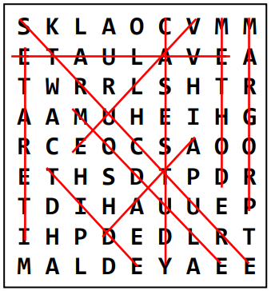

# WordSearch-Solver
Project to analyse the efficiency of solving a word search with different methods

The objective of this task was to implement alternative data structures for wordsearch puzzles, and related wordsearch dictionaries, and to investigate and report on their operational efficiency.

### What is a Wordsearch
A WordSearch puzzle comprises a rectangular (normally square) grid of letters in which a number of words are hidden, and the goal of the puzzle is to find all the words present. The number of words hidden may or may not be specified, and the search may be aided by a dictionary of words to find, or it may be that the topic context is known (e.g., computer science) and the puzzler has to use their knowledge to decide what relevant words they can find.

The words may be hidden within rows and/or columns of the grid, and possibly diagonally, and possibly each in either direction (see illustration). Words may also cross over, so one letter cell in the grid may contribute to several target words.

If a dictionary is provided to support the searching, this may contain either the target words only, or the target words together with many other words to make the puzzle harder.

In this project all puzzle grids can assumed to be square.



## Objective
Compare the efficiency of solving the wordsearch with 'simple' array-based structured compared to using a more advanced tree structure for either the grid or dictionary. Diagnostic results for both methods should be included in a results report.

### Provided files
Each grid puzzle will be in a text file called **wordsearch_grid.txt** and you are to implement code that can populate the grid of your data structure by reading the letters contained in the file. The data file consists of a single integer (n), followed by n * n letters, each in the range A-Z. You can assume that all letters and words provided are in upper-case format.

A dictionary will be provided in **dictionary.txt**.

**Example Ouutput**
```
NUMBER_OF_WORDS_MATCHED n

WORDS_MATCHED_IN_GRID
n1 n2 WORD1
n1 n2 WORD2
etc.

WORDS_UNMATCHED_IN_GRID
WORDn
etc.

NUMBER_OF_GRID_CELLS_VISITED n
NUMBER_OF_DICTIONARY_ENTRIES_VISITED n

TIME_TO_POPULATE_GRID_STRUCTURE f
TIME_TO_SOLVE_PUZZLE f
```

## Tree structure for dictionary


## ToDo
- How do both solutions deal with repeated words?
- Clean up tree structure to reduce tree size as words are discovered in advanced solution (destructor for Cell class)


## Bugs
- Simple solution incompatable with 2 letter words
